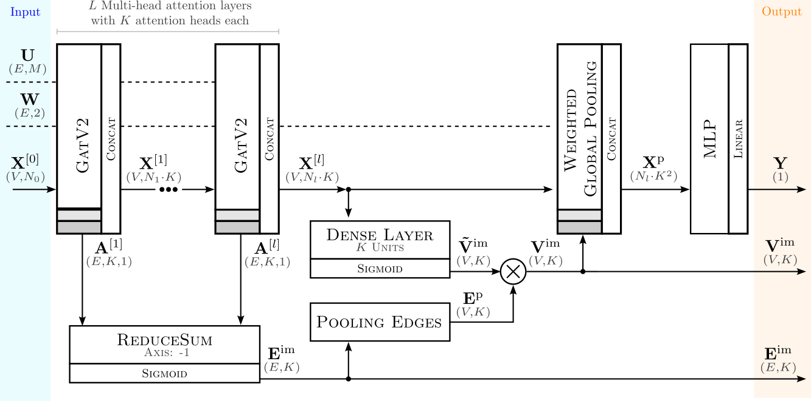
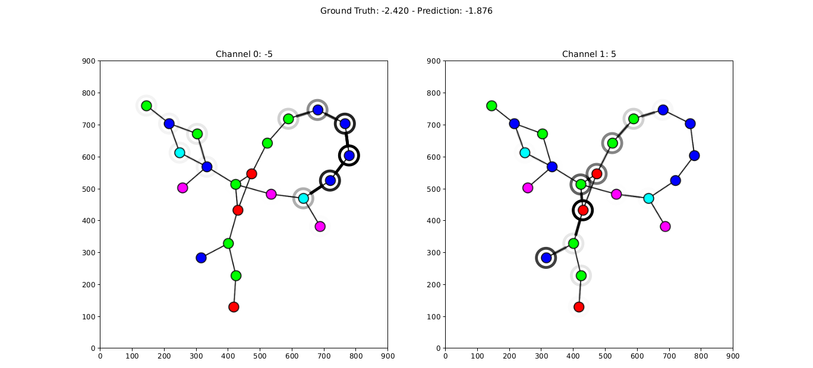
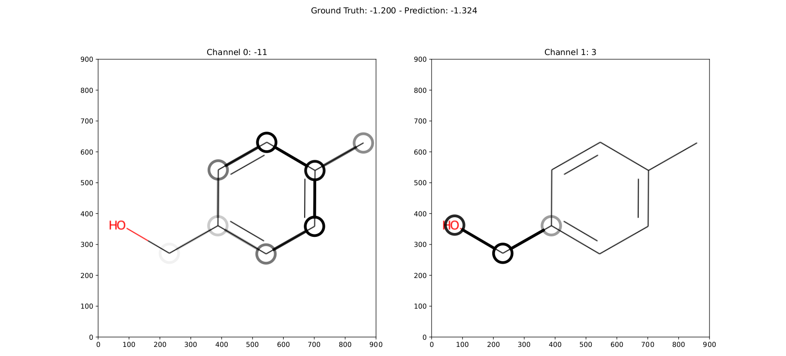
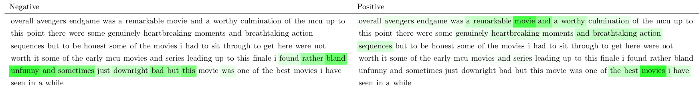
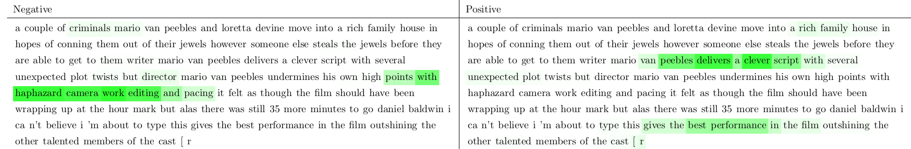

|made-with-python| |made-with-kgcnn| |python-version| |os-linux|

.. |os-linux| image:: https://img.shields.io/badge/os-linux-orange.svg
   :target: https://www.python.org/

.. |python-version| image:: https://img.shields.io/badge/Python-3.8.0-green.svg
   :target: https://www.python.org/

.. |made-with-kgcnn| image:: https://img.shields.io/badge/Made%20with-KGCNN-blue.svg
   :target: https://github.com/aimat-lab/gcnn_keras

.. |made-with-python| image:: https://img.shields.io/badge/Made%20with-Python-1f425f.svg
   :target: https://www.python.org/

================================================
MEGAN: Multi Explanation Graph Attention Student
================================================

**Abstract.** Explainable artificial intelligence (XAI) methods are expected to improve trust during human-AI interactions,
provide tools for model analysis and extend human understanding of complex problems. Attention-based models
are an important subclass of XAI methods, partly due to their full differentiability and the potential to
improve explanations by means of explanation-supervised training. We propose the novel multi-explanation
graph attention network (MEGAN). Our graph regression and classification model features multiple explanation
channels, which can be chosen independently of the task specifications. We first validate our model on a
synthetic graph regression dataset, where our model produces single-channel explanations with quality
similar to GNNExplainer. Furthermore, we demonstrate the advantages of multi-channel explanations on one
synthetic and two real-world datasets: The prediction of water solubility of molecular graphs and
sentiment classification of movie reviews. We find that our model produces explanations consistent
with human intuition, opening the way to learning from our model in less well-understood tasks.

=======
🔔 News
=======

- **March 2023** - The `paper`_ was accepted at the `1st xAI world conference <https://xaiworldconference.com/2023/>`_
- **June 2023** - Check out the `MeganExplains`_ web interface @ https://megan.aimat.science/. The interface allows to query MEGAN models trained on 
  different graph prediction tasks and to visualize the corresponding explanations provided by the model.
- **October 2023** - The `paper`_ is published with Springer in the xAI conference proceedings: https://link.springer.com/chapter/10.1007/978-3-031-44067-0_18
 
===========================
📦 Installation from Source
===========================

Clone the repository from github:

.. code-block:: shell

    git clone https://github.com/aimat-lab/graph_attention_student

Due to a problem with the ``torch-scatter`` package, the ``torch`` package has to be installed first.

.. code-block:: shell

    pip3 install torch==2.1.2

Then in the main folder run a ``pip install``:

.. code-block:: shell

    cd graph_attention_student
    pip3 install -e .

Alternatively, you can also use the `poetry`_ package manager for the installation:

.. code-block:: shell

    cd graph_attention_student
    poetry install

==========================
📦 Installation by Package
==========================

The package is also published as a library on PyPi and can be installed like this:

.. code-block:: shell

    pip3 install graph_attention_student

=============
🚀 Quickstart
=============

This package provides some functionality to load a pre-trained MEGAN model from the disk. The following code will illustrate 
this for the example of predicting a molecular graph's water solubility using the default MEGAN model that is included in the 
package for this task.

.. code-block:: python

    import os
    import typing as t

    import tensorflow as tf
    import tensorflow.keras as ks
    from visual_graph_datasets.utils import dynamic_import
    from graph_attention_student.utils import ASSETS_PATH
    from graph_attention_student.models import load_model

    # We want to predict the water solubility for the molecule represented as this SMILES code
    SMILES = 'CN1C=NC2=C1C(=O)N(C(=O)N2C)C'

    # Loading the model
    model_path = os.path.join(ASSETS_PATH, 'models', 'aqsoldb')
    model = load_model(model_path)

    # For the inference we have to convert the SMILES string into the proper molecular graph
    module = dynamic_import(os.path.join(model_path, 'process.py'))
    processing = module.processing
    graph = processing.process(SMILES)
    
    # THe model outputs the node and edge explanation masks directly alongside the main target value prediction
    out_pred, ni_pred, ei_pred = model.predict_graphs([graph])[0]
    print(f'Solubility: {out_pred:.2f}')

.. _kgcnn: https://github.com/aimat-lab/gcnn_keras
.. _examples/solubility_regression.py: https://github.com/aimat-lab/graph_attention_student/tree/master/graph_attention_student/examples/solubility_regression.py
.. _`GATv2`: https://github.com/tech-srl/how_attentive_are_gats

================================
🤖 Training a Custom MEGAN Model
================================

If you are interested in training a custom MEGAN model for your own graph dataset, then you can do that as well. The easiest way to do this 
generally consists of the following two steps:

1. Convert your custom dataset into the `visual graph dataset`_ (VGD) format.
2. Create a new sub-experiment module which then uses that VGD to train the model for you.

Converting the Dataset
======================

The existing MEGAN training implementations are based on the `visual graph dataset`_ (VGD) format. In this format a dataset of graph elements is given as a 
folder that represents each element as one JSON file containing all the canonical graph structure, and a PNG file showing the canonical graph visualization.
You can learn more about the VGD format in this repository: https://github.com/aimat-lab/visual_graph_datasets

The VGD repository offers convenient pre-defined methods to directly convert datasets from various application domains. Perhaps most notably, there is the 
option to directly convert a dataset of molecular graphs given as *a CSV of SMILES codes* into the VGD format. For further details regarding this please refer 
to the following documentation: https://github.com/aimat-lab/visual_graph_datasets#-converting-datasets

Sub Experiment for Training
===========================

All of the computational experiments in this repository are implemented with the PyComex_ microframework. This framework enforces a common structure to all the 
experiment modules, but offers some convenient features in return. One of those features is *experiment inheritance* which allows to define a sub-experiment in 
a similar way in which sub-classes are created in object oriented programming. These sub-experiments inherit the majority of the of the code from the base experiment 
but are able to modify the experiment parameters and inject custom code via a hook system.
You can learn more about the PyComex framework in general here: https://github.com/the16thpythonist/pycomex

To train a custom MEGAN model it is advised to extend on the ``vgd_single__megan2.py`` base experiment, which uses the most recent version of the MEGAN model.
In this module, it is only necessary to customize the values of the global experiment parameters, after which the module can be executed to start the model 
training process.

.. code-block:: python

    """new file: vgd_single__megan2__custom.py"""
    import os
    import typing as t

    import tensorflow as tf
    from pycomex.functional.experiment import Experiment
    from pycomex.utils import file_namespace, folder_path

    from graph_attention_student.utils import EXPERIMENTS_PATH

    # == CUSTOMIZE HERE ==

    # -- DATASET CONFIGURATION --
    # Fill in the path to your dataset here
    VISUAL_GRAPH_DATASET_PATH: str = '../path/to/your/vgd'
    # The type of dataset it is
    DATASET_TYPE: str = 'regression'  # or 'classification'
    # The number of target labels that the dataset has
    NUM_TARGETS: int = 1
    # the ratio of the dataset to be used for training (rest is test set)
    TRAIN_RATIO: float = 0.8
    # The number of randomly chosen example elements from the test set to be 
    # plotting the explanations for.
    NUM_EXAMPLES: int = 100

    NODE_IMPORTANCES_KEY: t.Optional[str] = None  # dont modify
    EDGE_IMPORTANCES_KEY: t.Optional[str] = None  # dont modify

    # -- MODEL CONFIGURATION --
    # the numbers of hidden units in the gnn layers
    UNITS = [32, 32, 32]
    # the number of units in the projection layers
    EMBEDDING_UNITS = [32, 64]
    # the number of units in the final prediction mlp layers
    FINAL_UNITS = [32, NUM_TARGETS]
    # Choose the correct activation for regression(linear) vs classification(softmax) 
    FINAL_ACTIVATION: str = 'linear'
    # Configure the training process
    BATCH_SIZE: int = 32
    EPOCHS: int = 10
    DEVICE: str = 'cpu:0'

    # -- EXPLANATION CONFIGURATION --
    # The number of distinct explanations to be created
    IMPORTANCE_CHANNELS: int = 2
    # the weight of the explanation training loss
    IMPORTANCE_FACTOR: float = 1.0
    # the weight of the fidelity training loss
    FIDELITY_FACTOR: float = 0.1
    # the weight of the sparsity training loss
    SPARSITY_FACTOR: float = 1.0
    # the fidelity functionals
    FIDELITY_FUNCS = [
        lambda org, mod: tf.nn.relu(mod - org),
        lambda org, mod: tf.nn.relu(org - mod),
    ]
    # Choose "None" in case of classification
    REGRESSION_REFERENCE: float = 0.0

    # == DO NOT MODIFY ==

    __DEBUG__ = False
    __TESTING__ = False
    experiment = Experiment.extend(
        os.path.join(EXPERIMENTS_PATH, 'vgd_single__megan2.py'),
        base_path=folder_path(__file__),
        namespace=file_namespace(__file__),
        glob=globals()
    )

    experiment.run_if_main()

**Configuring the MEGAN model.** Much of the configuration that has to be done for the training process is similar to 
"normal" neural network configuration, such as the choice of each layers hidden units, the final activation function, the training 
batch size and epochs etc. It is generally recommended to leave these parameters at their default values at first and only 
adjust them when a problem becomes apparent such as a clear over- or under-fitting.

Aside from the normal parameters, notably some configuration is also necessary for the *explanation* aspect of the model.
These parameters have only marginal impact on the final precition performance of the model but will determine how usable the 
resulting explanations will be. Some of these parameters will be discussed there briefly, but to get a better understanding of 
the purpose of these parameters it is recommended to read the `paper`_

- *Number or importance channels.* One of MEGAN's distinct features is that the number of explanations that is generated for each 
  prediction is a hyperparameter ``IMPORTANCE_CHANNELS`` of the model instead of depending on the task specifications. 
  However, to properly make use of the explanations the following restrictions currently apply: For a classification problem 
  choose ``IMPORTANCE_CHANNELS`` same as the number of possible output classes. For regression tasks, currently only single-value 
  regression problems are supported, in which case choose ``IMPORTANCE_CHANNELS = 2``. In this case, the first channel (index 0) will represent the 
  negatively influencing structures and the second channel (index 1) will represent the positively influencing structures.
- *Regression Reference.* One particularly important parameter for regression tasks is ``REGRESSION_REFERENCE``. This value determines 
  which kinds of target values are even considered "negative" vs "positive". Therefore this parameter strongly influences how the 
  explanations will turn out. A good starting point for this parameter is to choose it as the average value over the target labels of 
  the given dataset. Depending on how the explanations turn out, it may have to be adjusted afterwards.
- *Loss Weights.* During training, a MEGAN model is subject to various different loss terms whose weights can be set using the 
  parameters ``IMPORTANCE_FACTOR``, ``FIDELITY_FACTOR`` and ``SPARSITY_FACTOR``. It is generally recommended to leave them at 
  their default value, but depending on the circumstances it might be necessary to adjust them.

===========
🔍 Examples
===========

The following examples show some of the *cherry picked* examples that show the explanatory capabilities of
the model.

RB-Motifs Dataset
=================

This is a synthetic dataset, which basically consists of randomly generated graphs with nodes of different
colors. Some of the graphs contain special sub-graph motifs, which are either blue-heavy or red-heavy
structures. The blue-heavy sub-graphs contribute a certain negative value to the overall value of the graph,
while red-heavy structures contain a certain positive value.

This way, every graph has a certain value associated with it, which is between -3 and 3. The network was
trained to predict this value for each graph.

The examples shows from left to right: (1) The ground truth explanations, (2) a baseline MEGAN model trained
only on the prediction task, (3) explanation-supervised MEGAN model and (4) GNNExplainer explanations for a
basic GCN network. While the baseline MEGAN and GNNExplainer focus only on one of the ground truth motifs,
the explanation-supervised MEGAN model correctly finds both.

Water Solubility Dataset
========================

This is the `AqSolDB`_ dataset, which consists of ~10000 molecules and measured values for the solubility in
water (logS value).

The network was trained to predict the solubility value for each molecule.

.. _`AqSolDB`: https://www.nature.com/articles/s41597-019-0151-1

Movie Reviews
=============

Originally the *MovieReviews* dataset is a natural language processing dataset from the `ERASER`_ benchmark.
The task is to classify the sentiment of ~2000 movie reviews collected from the IMDB database into the
classes "positive" and "negative". This dataset was converted into a graph dataset by considering all words
as nodes of a graph and then connecting adjacent words by undirected edges with a sliding window of size 2.
Words were converted into numeric feature vectors by using a pre-trained `GLOVE`_ model.

Example for a positive review:

Example for a negative review:

Examples show the explanation channel for the "negative" class left and the "positive" class right.
Sentences with negative / positive adjectives are appropriately attributed to the corresponding channels.

==============
📖 Referencing
==============

If you use, extend or otherwise mention or work, please cite the `paper`_ as follows:

.. code-block:: bibtex

    @article{teufel2023megan
        title={MEGAN: Multi-Explanation Graph Attention Network},
        author={Teufel, Jonas and Torresi, Luca and Reiser, Patrick and Friederich, Pascal},
        journal={xAI 2023},
        year={2023}
    }

==========
🫱🏻‍🫲🏾 Credits
==========

* PyComex_ is a micro framework which simplifies the setup, processing and management of computational
  experiments. It is also used to auto-generate the command line interface that can be used to interact
  with these experiments.
* VisualGraphDataset_ is a library which aims to establish a special dataset format specifically for graph
  XAI applications with the aim of streamlining the visualization of graph explanations and to make them
  more comparable by packaging canonical graph visualizations directly with the dataset.
* KGCNN_ Is a library for the creation of graph neural networks based on the RaggedTensor feature of the
  Tensorflow/Keras machine learning framework.

.. _PyComex: https://github.com/the16thpythonist/pycomex
.. _VisualGraphDataset: https://github.com/aimat-lab/visual_graph_datasets
.. _MEGAN: https://github.com/aimat-lab/graph_attention_student
.. _KGCNN: https://github.com/aimat-lab/gcnn_keras

.. _`ERASER`: https://www.eraserbenchmark.com/
.. _`GLOVE`: https://nlp.stanford.edu/projects/glove/

.. _`paper`: https://link.springer.com/chapter/10.1007/978-3-031-44067-0_18
.. _`poetry`: https://python-poetry.org/
.. _`MeganExplains`: https://megan.aimat.science/ 
.. _`visual_graph_dataset`: https://github.com/aimat-lab/visual_graph_datasets 