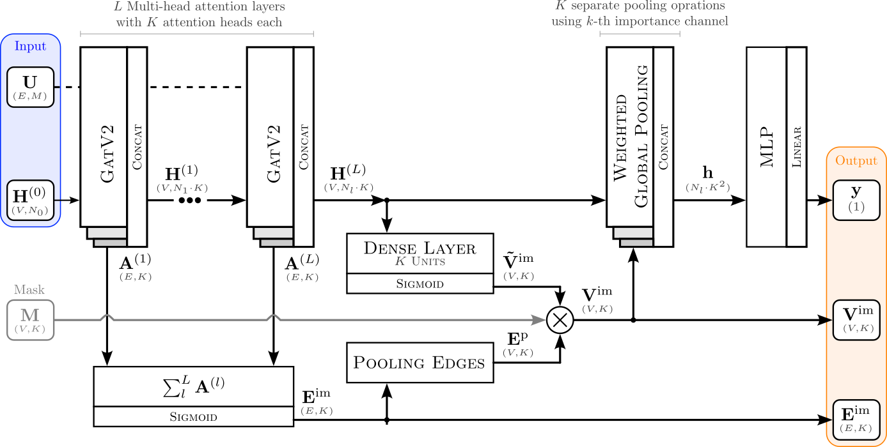
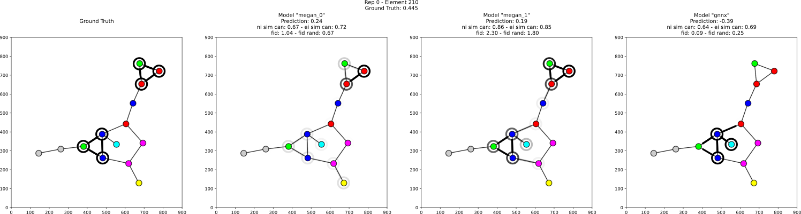

|made-with-python| |made-with-pytorch| |python-version| |os-linux|

.. |os-linux| image:: https://img.shields.io/badge/os-linux-orange.svg
   :target: https://www.python.org/

.. |python-version| image:: https://img.shields.io/badge/Python-3.8.0-green.svg
   :target: https://www.python.org/

.. |made-with-pytorch| image:: https://img.shields.io/badge/Made%20with-PyTorch-orange.svg
   :target: https://pytorch.org/

.. |made-with-python| image:: https://img.shields.io/badge/Made%20with-Python-1f425f.svg
   :target: https://www.python.org/

👩‍🏫 MEGAN: Multi Explanation Graph Attention Student
======================================================

**Abstract.** Explainable artificial intelligence (XAI) methods are expected to improve trust during human-AI interactions,
provide tools for model analysis and extend human understanding of complex problems. Attention-based models
are an important subclass of XAI methods, partly due to their full differentiability and the potential to
improve explanations by means of explanation-supervised training. We propose the novel multi-explanation
graph attention network (MEGAN). Our graph regression and classification model features multiple explanation
channels, which can be chosen independently of the task specifications. We first validate our model on a
synthetic graph regression dataset, where our model produces single-channel explanations with quality
similar to GNNExplainer. Furthermore, we demonstrate the advantages of multi-channel explanations on one
synthetic and two real-world datasets: The prediction of water solubility of molecular graphs and
sentiment classification of movie reviews. We find that our model produces explanations consistent
with human intuition, opening the way to learning from our model in less well-understood tasks.

🔔 News
-------

- **September 2025** - Version `1.0.0` of the package has finally been released!
- **April 2024** - The follow-up paper about *global concept explanations using an extension of MEGAN* is now available on arxiv: https://arxiv.org/abs/2404.16532 
- **October 2023** - The `paper`_ is published with Springer in the xAI conference proceedings: https://link.springer.com/chapter/10.1007/978-3-031-44067-0_18
- **June 2023** - Check out the `MeganExplains`_ web interface @ https://megan.aimat.science/. The interface allows to query MEGAN models trained on 
  different graph prediction tasks and to visualize the corresponding explanations provided by the model.
- **March 2023** - The `paper`_ was accepted at the `1st xAI world conference <https://xaiworldconference.com/2023/>`_

📦 Package Dependencies
-----------------------

- The package is designed to run in an environment `3.8 <= python <= 3.13`. 
- A graphics card with CUDA support (cuDNN) is recommended for model training.
- A **Linux** operating system is recommended for development.
 
📦 Installation by Package
--------------------------

The package is also published as a library on PyPi and can be installed like this:

.. code-block:: shell

     uv pip install graph_attention_student

📦 Installation from Source
---------------------------

Clone the repository from github:

.. code-block:: shell

    git clone https://github.com/aimat-lab/graph_attention_student

Then in the main folder run a `pip install`:

.. code-block:: shell

    cd graph_attention_student
    uv pip install -e .

.. warning::
   **Note for Windows Users**

   The visualization libraries ``cairosvg`` and ``weasyprint`` require additional system dependencies on Windows.
   Install MSYS2 from https://www.msys2.org/ and run:

   .. code-block:: bash

      pacman -S mingw-w64-ucrt-x86_64-cairo mingw-w64-ucrt-x86_64-gtk3 mingw-w64-ucrt-x86_64-glib2 mingw-w64-ucrt-x86_64-pango

   Add ``C:\msys64\ucrt64\bin`` to your PATH and set environment variable: ``WEASYPRINT_DLL_DIRECTORIES=C:\msys64\ucrt64\bin``

🚀 Quickstart
-------------

This example demonstrates the complete workflow for creating, training, and using a MEGAN model to predict molecular properties with explanations. The following code shows how to set up a model, train it, and make predictions for a single SMILES string:

.. code-block:: python

    from visual_graph_datasets.processing.molecules import MoleculeProcessing
    from graph_attention_student import Megan, SmilesDataset
    from graph_attention_student.torch.advanced import megan_prediction_report
    from torch_geometric.loader import DataLoader
    import pytorch_lightning as pl

    # Initialize molecule processing
    processing = MoleculeProcessing()

    # Create and configure the MEGAN model
    model = Megan(
        node_dim=processing.get_num_node_attributes(),
        edge_dim=processing.get_num_edge_attributes(),
        units=[64, 64, 64],
        final_units=[64, 32, 1],
        prediction_mode='regression',
        learning_rate=1e-4,
        importance_factor=1.0,  # Enable explanations
        sparsity_factor=0.5,
    )

    # Train the model (assuming you have a dataset CSV file)
    dataset = SmilesDataset(
        dataset="your_dataset.csv",
        smiles_column='smiles',
        target_columns=['value'],
        processing=processing,
        reservoir_sampling=True
    )
    loader = DataLoader(dataset, batch_size=64, num_workers=4)
    trainer = pl.Trainer(max_epochs=150, accelerator='auto')
    trainer.fit(model, train_dataloaders=loader)
    model.eval()

    # Make predictions with explanations
    SMILES = 'CN1C=NC2=C1C(=O)N(C(=O)N2C)C'  # Caffeine
    graph = processing.process(SMILES)
    results = model.forward_graph(graph)

    print(f"Predicted value: {results['graph_output'].item():.3f}")

    # Generate explanation report
    megan_prediction_report(
        value=SMILES,
        model=model,
        processing=processing,
        output_path="explanation_report.pdf"
    )

.. _`GATv2`: https://github.com/tech-srl/how_attentive_are_gats

💻 Command Line Interface
-------------------------

Once installed, the package exposes the `megan` command line interface which can be used to train models and generate predictions without the need to write additional code.

**Training Models**

Train MEGAN models directly from CSV datasets containing SMILES strings and target values:

.. code-block:: bash

    # Train a regression model (creates model.ckpt and process.py)
    megan train dataset.csv

    # Train a classification model with custom settings
    megan train data.csv --prediction-mode classification --final-units 64,32,3

Training automatically creates two files: ``model.ckpt`` (the trained model) and ``process.py`` (molecular processing configuration).

Use ``train --help`` for detailed options and examples.

**Making Predictions**

Generate predictions and visual explanations using the trained model files:

.. code-block:: bash

    # Predict using default model files
    megan predict "CCO"

    # Specify custom model and processing files
    megan predict "c1ccccc1" --model-path my_model.ckpt --processing-path my_process.py

Predictions generate numerical values and comprehensive PDF reports with molecular visualizations and explanation heatmaps showing which atoms contribute most to the prediction.

The CLI supports regression, binary classification, and multi-class classification tasks. Use ``--help`` with any command for detailed options and examples.

> [!NOTE]
> For advanced use cases requiring custom training loops or integration with existing ML pipelines, use the programmatic API detailed below.

🤖 Training a Custom MEGAN Model
--------------------------------

This section provides a detailed guide for training a custom MEGAN model on your own molecular dataset using the modern PyTorch Lightning-based API.

Dataset Preparation
-------------------

The MEGAN model can be trained directly on CSV files containing SMILES strings and target values. Your dataset should be structured as follows:

.. code-block:: text

    smiles,value
    CCO,1.23
    CCN,2.45
    CCC,0.89
    ...

For molecular datasets, the package uses the `SmilesDataset` class which handles the conversion from SMILES to graph representations automatically.

Model Configuration and Training
---------------------------------

Here's a complete example of how to train a custom MEGAN model:

.. code-block:: python

    import pytorch_lightning as pl
    from torch_geometric.loader import DataLoader
    from visual_graph_datasets.processing.molecules import MoleculeProcessing
    from graph_attention_student import Megan, SmilesDataset

    # Initialize molecule processing
    processing = MoleculeProcessing()

    # Create the dataset
    dataset = SmilesDataset(
        dataset="path/to/your/dataset.csv",
        smiles_column='smiles',  # Name of SMILES column
        target_columns=['value'],  # Name of target column(s)
        processing=processing,
        reservoir_sampling=True,  # Enables shuffling
    )

    # Create data loader
    loader_train = DataLoader(
        dataset,
        batch_size=64,
        drop_last=True,
        num_workers=4,
        prefetch_factor=2,
    )

    # Configure the MEGAN model
    model = Megan(
        # --- Graph Architecture ---
        node_dim=processing.get_num_node_attributes(),
        edge_dim=processing.get_num_edge_attributes(),
        units=[64, 64, 64],  # GNN layer sizes
        final_units=[64, 32, 1],  # Final MLP layers

        # --- Task Configuration ---
        prediction_mode='regression',  # or 'bce' for binary, 'classification' for multi-class
        learning_rate=1e-4,

        # --- Explanation Configuration ---
        importance_mode='regression',  # Match your prediction mode
        importance_factor=1.0,  # Weight of explanation loss (0.0 disables explanations)
        sparsity_factor=0.5,  # Encourages sparse explanations
        importance_offset=1.0,  # Controls explanation sparsity threshold
    )

    # Configure trainer
    trainer = pl.Trainer(
        max_epochs=150,
        accelerator='auto',  # Uses GPU if available
        devices='auto',
        # Optional: add callbacks for checkpointing, early stopping, etc.
    )

    # Train the model
    trainer.fit(model, train_dataloaders=loader_train)

    # Important: Switch to evaluation mode
    model.eval()

    # Save the trained model
    model.save("trained_model.ckpt")

Model Configuration Options
---------------------------

**Architecture Parameters:**

- ``units``: List defining the hidden dimensions of the GNN layers (e.g., ``[64, 64, 64]``)
- ``final_units``: List defining the final MLP structure. Last value must match the number of targets
- ``node_dim/edge_dim``: Input feature dimensions (automatically determined by processing)

**Training Parameters:**

- ``prediction_mode``: Task type - ``'regression'``, ``'bce'`` (binary classification), or ``'classification'``
- ``learning_rate``: Learning rate for the Adam optimizer
- ``batch_size``: Training batch size (set in DataLoader)

**Explanation Parameters:**

- ``importance_factor``: Weight of the explanation consistency loss (1.0 = explanations enabled)
- ``sparsity_factor``: Weight of the sparsity loss encouraging focused explanations
- ``importance_offset``: Threshold controlling explanation sparsity (higher = more sparse)
- ``importance_mode``: Should match your ``prediction_mode``

Loading and Using Trained Models
---------------------------------

.. code-block:: python

    # Load a previously trained model
    model = Megan.load("trained_model.ckpt")
    model.eval()

    # Make predictions
    graph = processing.process("CCO")  # Convert SMILES to graph
    results = model.forward_graph(graph)

    predicted_value = results['graph_output'].item()
    node_importance = results['node_importance']  # Explanation scores
    edge_importance = results['edge_importance']

    # Generate explanation visualization
    from graph_attention_student.torch.advanced import megan_prediction_report

    megan_prediction_report(
        value="CCO",
        model=model,
        processing=processing,
        output_path="prediction_report.pdf"
    )

🔍 Examples
-----------

The following examples show some of the *cherry picked* examples that show the explanatory capabilities of
the model.

RB-Motifs Dataset
~~~~~~~~~~~~~~~~~

This is a synthetic dataset, which basically consists of randomly generated graphs with nodes of different
colors. Some of the graphs contain special sub-graph motifs, which are either blue-heavy or red-heavy
structures. The blue-heavy sub-graphs contribute a certain negative value to the overall value of the graph,
while red-heavy structures contain a certain positive value.

This way, every graph has a certain value associated with it, which is between -3 and 3. The network was
trained to predict this value for each graph.

The examples shows from left to right: (1) The ground truth explanations, (2) a baseline MEGAN model trained
only on the prediction task, (3) explanation-supervised MEGAN model and (4) GNNExplainer explanations for a
basic GCN network. While the baseline MEGAN and GNNExplainer focus only on one of the ground truth motifs,
the explanation-supervised MEGAN model correctly finds both.

Water Solubility Dataset
~~~~~~~~~~~~~~~~~~~~~~~~

This is the `AqSolDB`_ dataset, which consists of ~10000 molecules and measured values for the solubility in
water (logS value).

The network was trained to predict the solubility value for each molecule.

.. image:: solubility_example.png
    :width: 800
    :alt: Solubility Example.png

.. _`AqSolDB`: https://www.nature.com/articles/s41597-019-0151-1

Movie Reviews
~~~~~~~~~~~~~

Originally the *MovieReviews* dataset is a natural language processing dataset from the `ERASER`_ benchmark.
The task is to classify the sentiment of ~2000 movie reviews collected from the IMDB database into the
classes "positive" and "negative". This dataset was converted into a graph dataset by considering all words
as nodes of a graph and then connecting adjacent words by undirected edges with a sliding window of size 2.
Words were converted into numeric feature vectors by using a pre-trained `GLOVE`_ model.

Example for a positive review:

Example for a negative review:

Examples show the explanation channel for the "negative" class left and the "positive" class right.
Sentences with negative / positive adjectives are appropriately attributed to the corresponding channels.

📖 Referencing
--------------

If you use, extend or otherwise mention or work, please cite the `paper`_ as follows:

.. code-block:: bibtex

    @article{teufel2023megan
        title={MEGAN: Multi-Explanation Graph Attention Network},
        author={Teufel, Jonas and Torresi, Luca and Reiser, Patrick and Friederich, Pascal},
        journal={xAI 2023},
        year={2023},
        doi={10.1007/978-3-031-44067-0_18},
        url="\url{https://link.springer.com/chapter/10.1007/978-3-031-44067-0_18\}",
    }

Credits
------------

* **PyTorch Lightning** provides the high-level training framework that powers the modern MEGAN implementation,
  offering easy GPU acceleration, distributed training, and experiment management.
* **PyTorch Geometric** supplies the fundamental graph neural network building blocks and efficient graph data handling
  that enable MEGAN's attention mechanisms and message passing operations.
* VisualGraphDataset_ is a library which aims to establish a special dataset format specifically for graph
  XAI applications with the aim of streamlining the visualization of graph explanations and to make them
  more comparable by packaging canonical graph visualizations directly with the dataset.
* PyComex_ is a micro framework which simplifies the setup, processing and management of computational
  experiments. It is also used to auto-generate the command line interface that can be used to interact
  with these experiments.

.. _PyComex: https://github.com/the16thpythonist/pycomex
.. _VisualGraphDataset: https://github.com/aimat-lab/visual_graph_datasets
.. _MEGAN: https://github.com/aimat-lab/graph_attention_student

.. _`ERASER`: https://www.eraserbenchmark.com/
.. _`GLOVE`: https://nlp.stanford.edu/projects/glove/

.. _`paper`: https://link.springer.com/chapter/10.1007/978-3-031-44067-0_18
.. _`poetry`: https://python-poetry.org/
.. _`MeganExplains`: https://megan.aimat.science/ 
.. _`visual_graph_dataset`: https://github.com/aimat-lab/visual_graph_datasets 